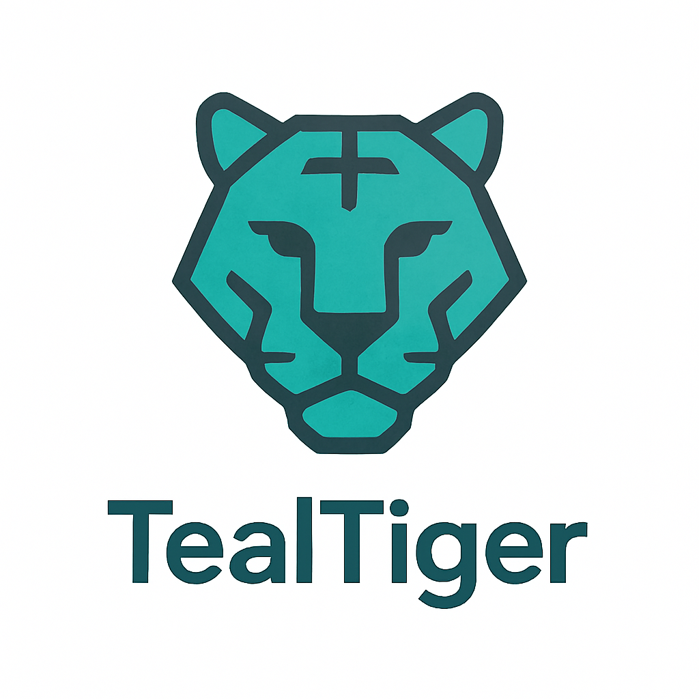

<div align="center">
  <picture>
    <source media="(prefers-color-scheme: dark)" srcset=".github/logo/tealtiger-logo-dark.png">
    <source media="(prefers-color-scheme: light)" srcset=".github/logo/tealtiger-logo-light.png">
    
  </picture>
  
  # TealTiger SDK

  > The first open-source AI agent security SDK with **client-side guardrails** 🛡️

  [](https://www.npmjs.com/package/tealtiger)
  [](https://www.npmjs.com/package/tealtiger)
  [](https://github.com/agentguard-ai/tealtiger-sdk/actions/workflows/test.yml)
  [](https://opensource.org/licenses/Apache-2.0)
  [](https://www.typescriptlang.org/)
  [](https://www.npmjs.com/package/tealtiger)
</div>

> 📖 **[Read the introduction blog post](https://dev.to/nagasatish_chilakamarti_2/introducing-tealtiger-ai-security-cost-control-made-simple-4lma)** | 📚 **[Documentation](https://docs.tealtiger.ai)**

## 🚀 Quick Start

```bash
npm install tealtiger
```

```typescript
import { TealOpenAI, GuardrailEngine, PIIDetectionGuardrail, PromptInjectionGuardrail } from 'tealtiger';

// Set up guardrails
const engine = new GuardrailEngine();
engine.registerGuardrail(new PIIDetectionGuardrail());
engine.registerGuardrail(new PromptInjectionGuardrail());

// Create guarded client — drop-in replacement for OpenAI
const client = new TealOpenAI({
  apiKey: process.env.OPENAI_API_KEY,
  agentId: 'my-agent',
  guardrailEngine: engine
});

const response = await client.chat.completions.create({
  model: 'gpt-4',
  messages: [{ role: 'user', content: 'Hello!' }]
});

console.log(response.choices[0].message.content);
console.log('Guardrails passed:', response.security?.guardrailResult?.passed);
```

## 🌐 Supported Providers

95%+ market coverage with 7 LLM providers:

| Provider | Client | Models | Features |
|----------|--------|--------|----------|
| **OpenAI** | `TealOpenAI` | GPT-4, GPT-3.5 Turbo | Chat, Completions, Embeddings |
| **Anthropic** | `TealAnthropic` | Claude 3, Claude 2 | Chat, Streaming |
| **Google** | `TealGemini` | Gemini Pro, Ultra | Multimodal, Safety Settings |
| **AWS** | `TealBedrock` | Claude, Titan, Jurassic, Command, Llama | Multi-model, Regional |
| **Azure** | `TealAzureOpenAI` | GPT-4, GPT-3.5 | Deployment-based, Azure AD |
| **Mistral** | `TealMistral` | Large, Medium, Small, Mixtral | EU Data Residency, GDPR |
| **Cohere** | `TealCohere` | Command, Embed | RAG, Citations, Connectors |

### Multi-Provider Orchestration

```typescript
import { TealMultiProvider, TealOpenAI, TealAnthropic } from 'tealtiger';

const multiProvider = new TealMultiProvider({
  strategy: 'priority',      // or 'round-robin', 'cost', 'use-case'
  enableFailover: true,
  maxFailoverAttempts: 3
});

multiProvider.registerProvider({
  type: 'openai',
  name: 'openai-primary',
  client: new TealOpenAI({ apiKey: 'key' }),
  priority: 1
});

multiProvider.registerProvider({
  type: 'anthropic',
  name: 'anthropic-backup',
  client: new TealAnthropic({ apiKey: 'key' }),
  priority: 2
});

// Automatic failover if primary fails
const response = await multiProvider.chat({
  messages: [{ role: 'user', content: 'Hello' }]
});
```

## 🛡️ Key Features

### TealEngine — Policy Evaluation

Deterministic policy evaluation with multi-mode enforcement:

```typescript
import { TealEngine, PolicyMode, DecisionAction, ReasonCode } from 'tealtiger';

const engine = new TealEngine({
  policies: myPolicies,
  mode: {
    defaultMode: PolicyMode.ENFORCE,       // or MONITOR, REPORT_ONLY
    policyModes: {
      'tools.file_delete': PolicyMode.ENFORCE,
      'identity.admin_access': PolicyMode.ENFORCE
    }
  }
});

const decision = engine.evaluate({
  agentId: 'agent-001',
  action: 'tool.execute',
  tool: 'file_delete',
  correlation_id: 'req-12345'
});

switch (decision.action) {
  case DecisionAction.ALLOW:
    await executeTool();
    break;
  case DecisionAction.DENY:
    if (decision.reason_codes.includes(ReasonCode.TOOL_NOT_ALLOWED)) {
      throw new ToolNotAllowedError(decision.reason);
    }
    break;
  case DecisionAction.REQUIRE_APPROVAL:
    await requestApproval(decision);
    break;
}

// Risk-based routing
if (decision.risk_score > 80) {
  await escalateToHuman(decision);
}
```

**Decision fields:** `action` (ALLOW, DENY, REDACT, TRANSFORM, REQUIRE_APPROVAL, DEGRADE), `reason_codes` (standardized enums), `risk_score` (0-100), `correlation_id`, `metadata`

### TealGuard — Security Guardrails

Client-side guardrails that run in milliseconds with no server dependency:

```typescript
import { GuardrailEngine, PIIDetectionGuardrail, PromptInjectionGuardrail, ContentModerationGuardrail } from 'tealtiger';

const engine = new GuardrailEngine({ mode: 'parallel', timeout: 5000 });

engine.registerGuardrail(new PIIDetectionGuardrail({ action: 'redact' }));
engine.registerGuardrail(new PromptInjectionGuardrail({ sensitivity: 'high' }));
engine.registerGuardrail(new ContentModerationGuardrail({ threshold: 0.7 }));

const result = await engine.execute(userInput);
console.log('Passed:', result.passed);
console.log('Risk Score:', result.riskScore);
```

**Detects:** PII (emails, phones, SSNs, credit cards), prompt injection, jailbreaks, harmful content, custom patterns.

### TealCircuit — Circuit Breaker

Cascading failure prevention with automatic failover:

```typescript
import { TealCircuit } from 'tealtiger';

const circuit = new TealCircuit({
  failureThreshold: 5,
  resetTimeout: 30000,
  monitorInterval: 10000
});

// Wraps provider calls with circuit breaker protection
const response = await circuit.execute(() =>
  client.chat.completions.create({ model: 'gpt-4', messages })
);
```

### TealAudit — Audit Logging & Redaction

Versioned audit events with security-by-default PII redaction:

```typescript
import { TealAudit, RedactionLevel } from 'tealtiger';

const audit = new TealAudit({
  outputs: [new FileOutput('./audit.log')],
  config: {
    input_redaction: RedactionLevel.HASH,    // SHA-256 hash + size (default)
    output_redaction: RedactionLevel.HASH,
    detect_pii: true,
    debug_mode: false
  }
});
```

**Redaction levels:** HASH (default, production-safe), SIZE_ONLY, CATEGORY_ONLY, FULL, NONE (debug only).

### Correlation IDs & Traceability

End-to-end request tracking across all components:

```typescript
import { ContextManager } from 'tealtiger';

const context = ContextManager.createContext({
  tenant_id: 'acme-corp',
  app: 'customer-support',
  env: 'production'
});

// Context propagates through TealEngine, TealAudit, and all providers
const response = await client.chat.create({
  model: 'gpt-4',
  messages: [{ role: 'user', content: 'Hello' }],
  context: context
});

// Query audit logs by correlation_id
const events = audit.query({ correlation_id: context.correlation_id });
```

**Features:** Auto-generated UUID v4 correlation IDs, OpenTelemetry-compatible trace IDs, HTTP header propagation, multi-tenant support.

### Policy Test Harness

Validate policy behavior before production deployment:

```typescript
import { PolicyTester, TestCorpora } from 'tealtiger';

const tester = new PolicyTester(engine);
const report = tester.runSuite({
  name: 'Customer Support Policy Tests',
  tests: [
    {
      name: 'Block file deletion',
      context: { agentId: 'support-001', action: 'tool.execute', tool: 'file_delete' },
      expected: { action: DecisionAction.DENY, reason_codes: [ReasonCode.TOOL_NOT_ALLOWED] }
    },
    ...TestCorpora.promptInjection(),
    ...TestCorpora.piiDetection()
  ]
});

console.log(`Tests: ${report.passed}/${report.total} passed`);

// Export for CI/CD
const junitXml = tester.exportReport(report, 'junit');
```

```bash
# CLI usage
npx tealtiger test ./policies/*.test.json --coverage --format=junit --output=./results.xml
```

### Cost Tracking & Budget Management

Track costs across 50+ models and enforce spending limits:

```typescript
import { CostTracker, BudgetManager, InMemoryCostStorage } from 'tealtiger';

const storage = new InMemoryCostStorage();
const tracker = new CostTracker({ enabled: true });
const budgetManager = new BudgetManager(storage);

budgetManager.createBudget({
  name: 'Daily GPT-4 Budget',
  limit: 10.0,
  period: 'daily',
  alertThresholds: [50, 75, 90, 100],
  action: 'block',
  enabled: true
});

// Estimate before request
const estimate = tracker.estimateCost('gpt-4', { inputTokens: 1000, outputTokens: 500 }, 'openai');

// Check budget
const check = await budgetManager.checkBudget('agent-123', estimate);
if (!check.allowed) {
  console.log(`Blocked by: ${check.blockedBy?.name}`);
}
```

## 🛡️ OWASP Top 10 for Agentic Applications Coverage

TealTiger v1.1.0 covers **7 out of 10** OWASP ASIs through its SDK-only architecture:

| ASI | Vulnerability | Coverage | Components |
|-----|--------------|----------|------------|
| ASI01 | Goal Hijacking & Prompt Injection | 🟡 Partial | TealGuard, TealEngine |
| ASI02 | Tool Misuse & Unauthorized Actions | 🟢 Full | TealEngine |
| ASI03 | Identity & Access Control Failures | 🟢 Full | TealEngine |
| ASI04 | Supply Chain Vulnerabilities | 🔧 Support | TealAudit |
| ASI05 | Unsafe Code Execution | 🟢 Full | TealEngine |
| ASI06 | Memory & Context Corruption | 🟢 Full | TealEngine, TealGuard |
| ASI07 | Inter-Agent Communication Security | ❌ Platform | N/A |
| ASI08 | Cascading Failures & Resource Exhaustion | 🟢 Full | TealCircuit |
| ASI09 | Harmful Content Generation | 🔧 Support | TealGuard |
| ASI10 | Rogue Agent Behavior | 🟢 Full | TealAudit |

📖 [Complete OWASP ASI Mapping](../../OWASP-AGENTIC-TOP10-TEALTIGER-MAPPING.md) | [OWASP Top 10 for Agentic Applications](https://owasp.org/www-project-top-10-for-agentic-applications/)

## 🎯 Use Cases

- **Customer Support Bots** — Protect customer PII
- **Healthcare AI** — HIPAA compliance
- **Financial Services** — Prevent data leakage
- **E-commerce** — Secure payment information
- **Enterprise AI** — Policy enforcement and audit trails
- **Education Platforms** — Content safety

## 📚 Documentation

- [Full Documentation](https://docs.tealtiger.ai)
- [API Reference](https://docs.tealtiger.ai/api)
- [Examples](https://github.com/agentguard-ai/tealtiger-typescript/tree/main/examples)
- [Changelog](https://github.com/agentguard-ai/tealtiger-typescript/blob/main/CHANGELOG.md)

## 🤝 Contributing

We welcome contributions! Please see our [Contributing Guide](https://github.com/agentguard-ai/tealtiger-typescript/blob/main/CONTRIBUTING.md).

## 📄 License

Apache 2.0 — see [LICENSE](https://github.com/agentguard-ai/tealtiger-typescript/blob/main/LICENSE)

## 🔗 Links

- **npm**: https://www.npmjs.com/package/tealtiger
- **GitHub**: https://github.com/agentguard-ai/tealtiger-typescript
- **Python SDK**: https://pypi.org/project/tealtiger/
- **Documentation**: https://docs.tealtiger.ai
- **Contact**: reachout@tealtiger.ai
- **Issues**: https://github.com/agentguard-ai/tealtiger-typescript/issues

---

**Made with ❤️ by the TealTiger team**
